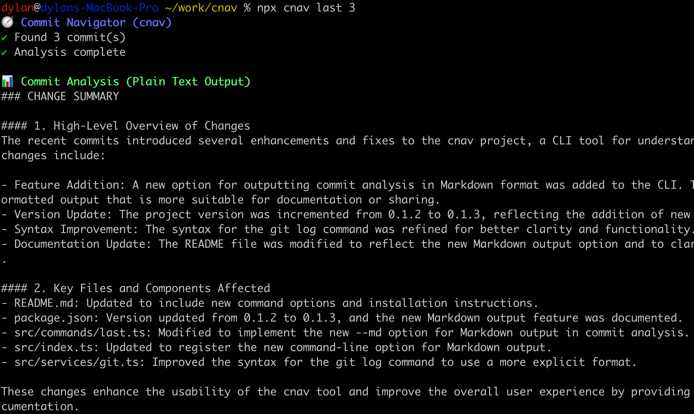

# 🧭 Commit Navigator (cnav)

[](https://www.npmjs.com/package/cnav)
[](https://opensource.org/licenses/MIT)

A simple CLI tool that helps you understand recent git commit changes using AI. Commit Navigator analyzes your git history and provides insights about code changes.

## ✨ Features

- **Analyze Recent Commits**: Get a clear summary of what changed and why
- **Code Review**: Automatically review changes for issues, improvements, and best practices
- **Changelog Generation**: Automatically update your CHANGELOG.md with well-written entries
- **Project Understanding**: Help new users or team members understand your project

## 🚀 Installation

```bash
# use with npx (nodej 16+)
npx cnav
npx cnav --help

# OR install cnav globally
npm install -g cnav
```

- REQUIRE: OPENAI_API_KEY env variable (get one at https://platform.openai.com/api-keys)
  - OR: ANTHROPIC_API_KEY env variable

## DEV

```bash
pnpm install
pnpm build
node dist/src/index.js last 3d
```


## 📋 Demo



## 📋 Usage

```bash
# Analyze the current directory
cnav    (OR: cnav analyze <path>)

# Review the last commit
cnav last

# Review the last 3 commits
cnav last 3

# Review commits from the last 7 days
cnav last --days 7
cnav last 7d  # shorthand

# Code review on recent changes
cnav last --review

# Update CHANGELOG file with recent changes
cnav changelog
```

## 📝 Command Reference

### `cnav last [count]`

Review the last N commits.

Options:
- `--review, -r`: Perform a code review on the commits
- `--days, -d <days>`: Review commits from the last N days
- `--md, -m`: Output analysis in Markdown format

Examples:
```bash
cnav last        # Review the last commit
cnav last 5      # Review the last 5 commits
cnav last -d 3   # Review commits from the last 3 days
cnav last -r     # Code review the last commit
cnav last -m     # Output analysis in Markdown format
```

### `cnav changelog`

Update CHANGELOG.md file with latest changes.

Options:
- `--format <format>`: Output format (`daily` or `weekly`, default: `weekly`)

Examples:
```bash
cnav changelog               # Generate weekly changelog
cnav changelog --format daily  # Generate daily changelog
```

## 🔐 Configuration

On first run, you'll be prompted to enter your OpenAI API key. You can also set it up manually:

1. Create a `.env` file in your working directory with:
```
OPENAI_API_KEY=your_api_key_here
```

2. Or export as an environment variable:
```bash
export OPENAI_API_KEY=your_api_key_here
```

## 💼 Use Cases

- **New Team Members**: Quickly get up to speed on project history and recent changes
- **Code Reviews**: Automate first-pass code reviews to catch common issues
- **Documentation**: Keep your changelog up-to-date automatically
- **Project Handovers**: Document project's architectural patterns and design decisions
- **Security**: Identify complex vulnerability patterns and potential issues
- **Architecture**: Get insights on architectural changes and technical decisions

## 📜 License

This project is licensed under the MIT License - see the LICENSE file for details.
